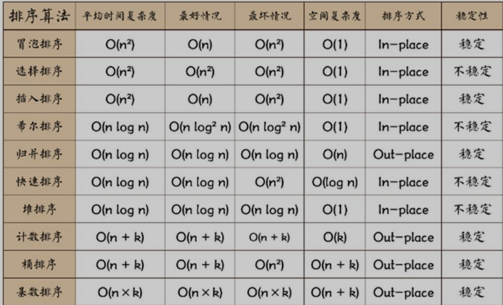

# 排序算法


- 插入排序（直接插入；折半插入；希尔插入）
- 选择排序（简单选择排序；堆排序）
- 交换排序 (冒泡排序；快速排序)
- 归并排序
- 基数排序
- 外部排序


## 冒泡排序

两两比较相邻元素，每趟冒泡的结果是把序列中的最大元素放到了序列中的最终位置
```
    public void bubbleSort(int[] array){
        int temp;
        for (int i = 0; i < array.length ; i++) {
            for (int j = 0; j < array.length-1-i ; j++) {
                if(array[j]<array[j+1]){
                    temp = array[j];
                    array[j] =  array[j+1];
                    array[j+1] = temp;
                }
            }
        }
    }
```

## 快速排序
快速排序是冒泡排序的一种改进。基本思想是:通过一趟排序将要排序的数据分割成独立的两部分，其中一部分的所有数据都比另一部分的所有数据小，然后再按此方法对这两部分数据分别进行快速排序，整个排序过程可以递归进行，已达到整个序列变成有序序列。

```
public void quickSort(int[] array,int low,int high){
        if(low<high){
            int index = getIndex(array,low,high);
            quickSort(array,low,index-1);
            quickSort(array,index+1,high);
        }
    }

    public int getIndex(int[] array,int low,int high){
        int temp = array[low];
        while (low<high){

            while(low<high && array[high]>temp){
                high--;
            }
            array[low] = array[high];
            while (low<high && array[low]<temp){
                low++;
            }
            array[high] = array[low];
        }
        array[low] = temp;
        return  low;
    }
```


## 直接插入排序
基本思想：每一步将一个待排序的数据插入到前面已经排好序的有序序列中，直到插完所有元素为止。

```
public void insertSort(int[] array){
        int j;
        for (int i = 1; i <array.length ; i++) {
            int temp = array[i];
            for (j = i-1; j>=0 && temp<array[j] ; j--) {
                array[j+1] = array[j];
            }
            array[j+1] = temp;
        }
    }
```

## 希尔排序
思想和直接插入类似，只是引入增量的概念，又称缩小增量排序

```
public void shellSort(int[] array){
        int j;
        for(int gap = array.length/2;gap>0;gap/=2){
            for(int i = gap;i<array.length;i++){
                int temp = array[i];
                for(j = i-gap;j>=0&&temp<array[j];j-=gap){
                    array[j+gap] = array[j];
                }
                array[j+gap] = temp;
            }
        }
    }
```

## 选择排序

假设排序表为L[1...n],第i趟排序即从L[i...n]中选择关键字最小的元素与L(i)交换，每一趟排序可以确认一个元素的最终位置,这样经过n-1趟排序就可使整个排序表有序。

```
public void selectSort(int[] array){
        int minValue;
        int minIndex;
        for (int i = 0; i < array.length; i++) {
            minValue = array[i];
            minIndex = i;
            for (int j = i+1; j <array.length ; j++) {
                if(minValue>array[j]){
                    minValue = array[j];
                    minIndex = j;
                }
            }
            //交换最小值
            if(minValue!=array[i]){
                array[minIndex] = array[i];
                array[i] = minValue;
            }
        }
    }
```


## 归并排序
采用分治的思想，分成一些小问题递归求解。将数组元素一个个分成独立元素，再两两合并，以此类推得到完整的有序序列。
```
public void mergeSortTest(){
        int[] array = {10,9,8,7,6,5};
        int[] temp = new int[array.length];
        mergeSort(array,0,array.length-1,temp);
        System.out.println(Arrays.toString(array));
    }

    public void mergeSort(int[] array,int left,int right,int[] temp){
        if(left<right){
            int mid = (left+right)/2;
            mergeSort(array,left,mid,temp);
            mergeSort(array,mid+1,right,temp);
            merge(array,left,mid,right,temp);
        }

    }

    public void merge(int[] array,int left ,int mid,int right,int[] temp){
        int i = left;
        int j = mid+1;
        int t = 0;
        while (i<=mid && j<=right){
            if(array[j]<array[i]){
                temp[t] = array[j];
                j++;
            }else{
                temp[t] = array[i];
                i++;
            }
            t++;
        }

        while (i<=mid){
            temp[t] = array[i];
            i++;
            t++;
        }

        while (j<=right){
            temp[t] = array[j];
            j++;
            t++;
        }

        //合并
        t = 0 ;
        while (left<=right){
            array[left] = array[t];
            left++;
            t++;
        }

    }

```

## 基数排序
基数排序(Radix Sort)是桶排序的扩展，它的基本思想是：将整数按位数切割成不同的数字，然后按每个位数分别比较。
具体做法是：将所有待比较数值统一为同样的数位长度，数位较短的数前面补零。然后，从最低位开始，依次进行一次排序。这样从最低位排序一直到最高位排序完成以后, 数列就变成一个有序序列。

```
public void radixSortTest(int[] array){
        //求最大值
        int maxValue = array[0];
        for(int value:array){
            if(value>maxValue){
                maxValue = value;
            }
        }
        //求最大值位数
        int digit = (maxValue+"").length();

        //桶数量
        int[][] buckets = new int[10][array.length];
        //每个桶计数
        int[] bucketNum  = new int[10];
        for(int i = 0,n = 1;i<digit;i++,n*=10){
            //元素放入桶中
            for(int j=0;j<array.length;j++){
                int digitValue = array[j]/n%10;
                buckets[digitValue][bucketNum[digitValue]] = array[j];
                bucketNum[digitValue]++;
            }
            int index = 0;
            //将元素放入回数组中
            for (int k = 0; k <bucketNum.length ; k++) {
                if(bucketNum[k]!=0){
                    for(int l = 0;l<bucketNum[k];l++){
                        array[index++] = buckets[k][l];
                    }
                }
                bucketNum[k] = 0;
            }

        }
    }
```

## 排序算法比较


